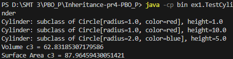
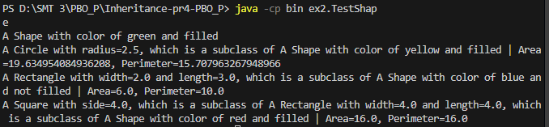
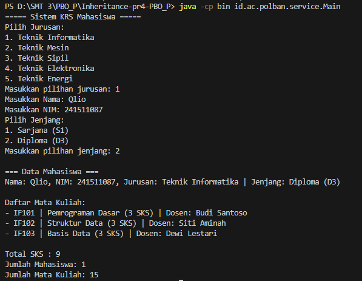

# Inheritance & Polymorphism - Praktikum 4 PBO

Repositori ini berisi kode sumber Java untuk tugas **Praktikum 4: Konsep Pewarisan (Inheritance)**.

Proyek ini terdiri dari tiga bagian utama yang mendemonstrasikan implementasi konsep *Inheritance*, *Overriding*, `super` keyword, dan *Polymorphism*:

1.  **Exercise 1 (Cylinder)**: Pewarisan sederhana dari `Circle` ke `Cylinder`.
2.  **Exercise 2 (Shape)**: Hirarki pewarisan bertingkat (`Shape` -> `Rectangle` -> `Square`).
3.  **KRS App Update**: Implementasi inheritance pada studi kasus KRS Mahasiswa (`Mahasiswa` -> `MahasiswaSarjana` & `MahasiswaDiploma`).

## 📂 Daftar Program & Screenshot

Berikut adalah rincian program yang ada dalam repositori ini:

### 1. Exercise 1: Cylinder Calculation
Menghitung luas permukaan dan volume tabung dengan memanfaatkan *method overriding* dari kelas induk lingkaran.
> **Output:**
> 

### 2. Exercise 2: Shape Hierarchy
Mendemonstrasikan hierarki kelas bentuk geometri, di mana `Square` mewarisi `Rectangle`, dan `Rectangle` mewarisi `Shape`.
> **Output:**
> 

### 3. Sistem KRS (Polymorphism)
Pengembangan aplikasi KRS dengan membedakan jenis mahasiswa (Sarjana/Diploma) menggunakan pewarisan, namun tetap dikelola dalam satu tipe data induk (`Mahasiswa`).
> **Output:**
> 

---

## 🚀 Cara Menjalankan (How to Run)

Pastikan kamu sudah menginstal **JDK (Java Development Kit)**.

1.  **Buka Terminal / Command Prompt**.
2.  **Arahkan ke direktori folder ini**:
    ```bash
    cd path/to/Inheritance-pr4-PBO_P
    ```
3.  **Compile & Run**:
    Lakukan kompilasi sekali untuk semua file, lalu jalankan sesuai program yang ingin dicoba.

    **Langkah 1: Kompilasi (Wajib dilakukan di awal)**
    ```bash
    javac -d bin src/ex1/*.java src/ex2/*.java src/id/ac/polban/model/*.java src/id/ac/polban/service/*.java
    ```

    **Langkah 2: Jalankan Program**
    Gunakan perintah berikut untuk menjalankan masing-masing tugas:

    | Tugas | Main Class | Perintah Run |
    | :--- | :--- | :--- |
    | **Exercise 1** | `ex1.TestCylinder` | `java -cp bin ex1.TestCylinder` |
    | **Exercise 2** | `ex2.TestShape` | `java -cp bin ex2.TestShape` |
    | **KRS App** | `id.ac.polban.service.Main` | `java -cp bin id.ac.polban.service.Main` |

---

## 👤 Identitas Pengirim

- **Nama** : Qlio Amanda Febriany
- **NIM** : 241511087
- **Kelas** : 2C
- **Prodi** : D3 Teknik Informatika
